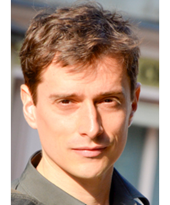
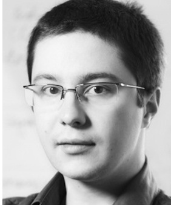
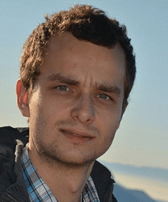
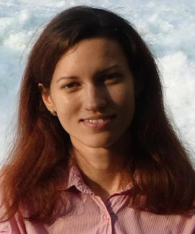
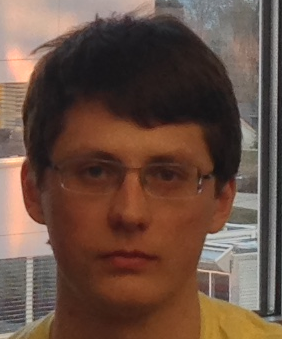
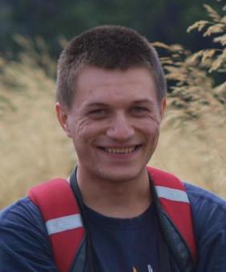
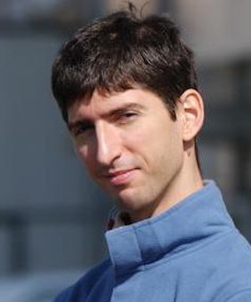

## People

<table class="custom_table" style="border:0px;" cellspacing="5">
    <tr>
            <td style="border:0px;"></td>
            <td style="border:0px;"> <a href="http://people.epfl.ch/vitaly.chipounov" target="_blank" class="external">Vitaly Chipounov</a></td>
            <td style="border:0px;width:25px;"></td>
            <td style="border:0px;"></td>
            <td style="border:0px;"> <a href="http://people.epfl.ch/george.candea" target="_blank" class="external">Prof. George Candea</a></td>
    </tr>
    <tr><td></td></tr>
    <tr>
            <td style="border:0px;"></td>
            <td style="border:0px;"> <a href="http://people.epfl.ch/cristian.zamfir" target="_blank" class="external">Cristian Zamfir</a></td>
            <td style="border:0px;width:25px;"></td>
            <td style="border:0px;"></td>
            <td style="border:0px;"> <a href="http://people.epfl.ch/vova.kuznetsov" target="_blank" class="external">Volodymyr Kuznetsov</a></td>
    </tr>
    <tr><td></td></tr>
    <tr>
            <td style="border:0px;"></td>
            <td style="border:0px;"> <a href="http://people.epfl.ch/stefan.bucur" target="_blank" class="external">Stefan Bucur</a></td>
            <td style="border:0px;width:25px;"></td>
            <td style="border:0px;"></td>
            <td style="border:0px;"> <a href="http://people.epfl.ch/radu.banabic" target="_blank" class="external">Radu Banabic</a></td>
    </tr>
    <tr><td></td></tr>
    <tr>
            <td style="border:0px;"></td>
            <td style="border:0px;"> <a href="http://people.epfl.ch/ana.sima" target="_blank" class="external">Ana Claudia Sima</a></td>
            <td style="border:0px;width:25px;"></td>
            <td style="border:0px;"></td>
            <td style="border:0px;"> <a href="http://people.epfl.ch/petr.zankov" target="_blank" class="external">Petr Zankov</a></td>
    </tr>
    <tr><td></td></tr>
    <tr>
            <td style="border:0px;"></td>
            <td style="border:0px;"> <a href="http://people.epfl.ch/alex.copot" target="_blank" class="external">Alexandru-Mihai Copot</a></td>
            <td style="border:0px;width:25px;"></td>
            <td style="border:0px;"></td>
            <td style="border:0px;"> <a href="http://people.epfl.ch/daniel.mahu" target="_blank" class="external">Daniel Mahu</a></td>
    </tr>
</table>

## Former Students

<a>Andy Roulin</a> 
Guest analysis tools

<a>Yoan Blanc</a> 
Cloud infrastructure

<a>Roger Michoud</a> 
Reliability testing

<a>Damien Engels</a> 
Toolchain integration

<a>Francesco Fucci</a> 
Fast dynamic binary interpreter

<a>João Carreira</a> 
Lightweight snapshotting

<a>Andreas Kirchner</a> 
First S2E ARM prototype

